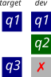
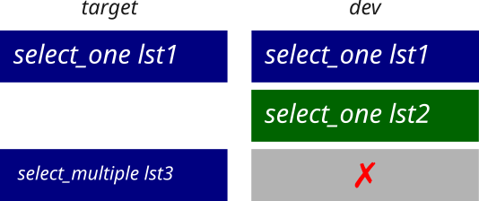
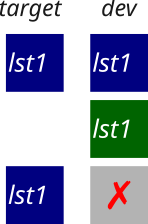
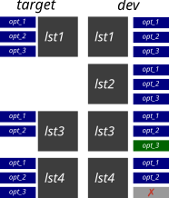

```{r}
#| label: setup

library(idem)
library(gt)
library(ggplot2)
library(knitr)

knitr::opts_chunk$set(
  execute = TRUE,
  echo = TRUE,
  message = FALSE,
  warning = FALSE
)

knit_print.xlsform <- function(x, ...) { # nolint: object_name_linter.
  out <- withr::with_options(
    list(cli.num_colors = 256),
    cli::cli_fmt({
      idem:::print.xlsform(x)
    })
  )
  html <- paste(fansi::sgr_to_html(out, classes = FALSE), collapse = "\n")
  knitr::asis_output(paste0("<pre>", html, "</pre>"))
}
```

## {idem} ?

::: columns

::::: {.column width="25%"}
::::::: fragment

:::::::
:::::

::::: {.column width="75%"}
::::::: fragment
{idem} helps you validate XLSForm files against a reference form: the MSNA
template.

::::::::: fragment
The main goal is to catch drift in:
:::::::::


- question names
- choice lists
- answer options

:::::::
:::::


:::

## A note on terminology

::: r-fit-text
**target**: HQ approved MSNA template
:::

## A note on terminology

::: r-fit-text
**dev**: a *development* form version, that's based on the **target**
:::

## MSNA form validation

For a form to be validated it has to be:

- **valid**: no errors or warnings upon uploading to the Kobotoolbox server
- **compliant**: based on the HQ template
- [approved by RSU]{.rn-fragment rn-type=underline rn-color=red}

## Compliance (1/4)

::: columns

::::: {.column width="25%"}
Every question name in the template must exist in country form
:::::


::::: {.column width="75%"}
{fig-align="center" style="height: 60vh;"}
:::::

:::

## Compliance (2/4)

::: columns

::::: {.column width="35%"}
Every choice list defined in the templates's choices sheet must also be defined
in country form's choices sheet.
:::::


::::: {.column width="65%"}
{fig-align="center" style="height: 60vh;"}
:::::

:::

## Compliance (3/4)

::: columns

::::: {.column width="35%"}
Every choice list referenced by template's survey questions must also be
referenced in country form's survey questions.
:::::


::::: {.column width="65%"}

{fig-align="center" style="height: 60vh;"}

:::::

:::

## Compliance (4/4)

::: columns

::::: {.column width="35%"}
For every shared list, every choice option in template must exist in the same
list in country form.
:::::


::::: {.column width="65%"}

{fig-align="center" style="height: 60vh;"}

:::::

:::

## Demo time

::: fragment
using `r packageVersion("idem")[1]`
:::

::: fragment
```{r}
#| echo: true

library(idem)

# load both forms
target <- msna_template_required
dev <- msna_template_required

# run all checks
issues <- validate_xlsform(target = target, dev = dev)
issues
```
:::

## Reading your local xlsform

```{r}
form_path <- system.file("extdata/form.xlsx", package = "idem")
read_xlsform(form_path)
```

## Performing checks (1/4)

## Validating question names: `validate_question_names()`

::: columns


::::: {.column width="25%"}
::::::: fragment
We explore how this check handles having extra questions in the `dev` for
:::::::
:::::

::::: {.column width="75%"}

::::::: fragment
```{r}
target <- msna_template_required
# Extra question
dev_extra_q <- target$survey[1L, ]
dev_extra_q$name <- "dev_only_question"
# Build xlsform
dev_with_extra_q <- xlsform(
  survey  = rbind(target$survey, dev_extra_q),
  choices = target$choices
)
```
:::::::

::::::: fragment
```{r}
validate_question_names(target, dev_with_extra_q)
```
:::::::
:::::
:::
